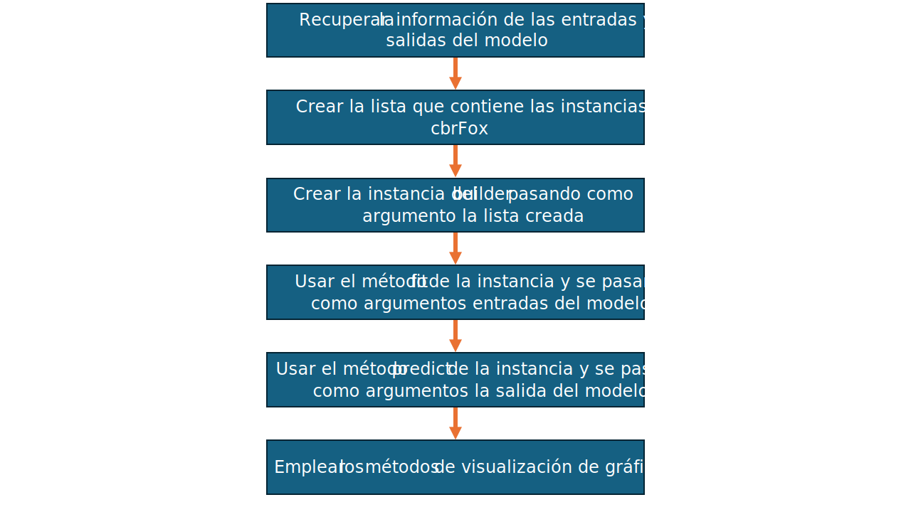
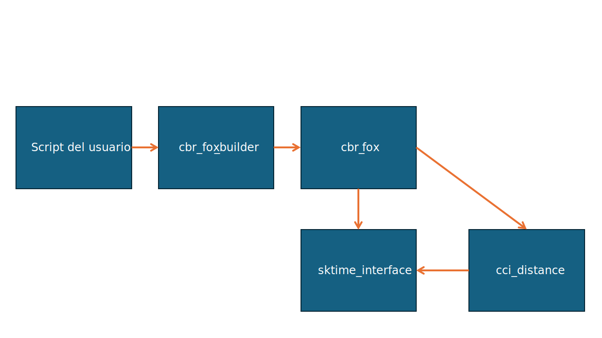

# CBR-FoX: Case-Based Reasoning for Time Series Prediction Explanations

CBR-FoX es una biblioteca en Python diseñada para proporcionar explicaciones basadas en razonamiento por casos para modelos de predicción de series temporales. Este enfoque ayuda a mejorar la transparencia y comprensión de los modelos de aprendizaje automático utilizados en datos secuenciales.

## Características

- Implementación del enfoque de CBR-FoX.
- Adaptable a diferentes tipos de series temporales.
- Compatible con modelos de aprendizaje automático comunes.
- Generación de explicaciones comprensibles.

## Instalación

Clona este repositorio e instala las dependencias:
```bash
git clone https://github.com/jerryperezperez/CBR-FoX.git
cd CBR-FoX
pip install -r requirements.txt
```

## Uso

Sigue estos pasos para usar CBRfox en tus proyectos:

1. **Recuperar la información del modelo:**
   Obtén las entradas y salidas generadas por tu modelo de IA.

2. **Crear instancias CBRfox:**
   ```python
   cbr_instances = CBRfoxInstances(model_outputs)
   ```

3. **Inicializar el Builder** 
   ```Python 
    builder = CBRfoxBuilder(cbr_instances)
    ```
4. **Entrenar la instancia:**
   ```Python 
    builder.fit(train_windows, train_targets, target_to_analyze, window_to_predict)
    ```
5. **Obtener las explicaciones:**
   ```Python 
    builder.predict(prediction = prediction,num_cases=5)
    ```
6. **Emplear métodos de visualización de gráficas:**
    ```Python 
    builder.visualize_pyplot(
        fmt = '--d',
        scatter_params={"s": 50},
        xtick_rotation=50,
        title="nombre",
        xlabel="x",
        ylabel="y"
    )
    ```
### Diagrama de uso de la biblioteca

El siguiente diagrama ilustra el flujo de trabajo típico al utilizar la biblioteca **CBRfox**. Desde la recuperación de las entradas y salidas del modelo de IA hasta la generación de explicaciones visuales, cada paso del proceso está diseñado para facilitar la interpretación y explicación de predicciones basadas en series temporales.



### Diagrama de la relación de los archivos de la biblioteca

El siguiente diagrama muestra las clases involucradas en el funcionamiento básico de la biblioteca. El archivo `cci_distance` se utiliza al crear una instancia que emplea la técnica homónima implementada en dicho script.


