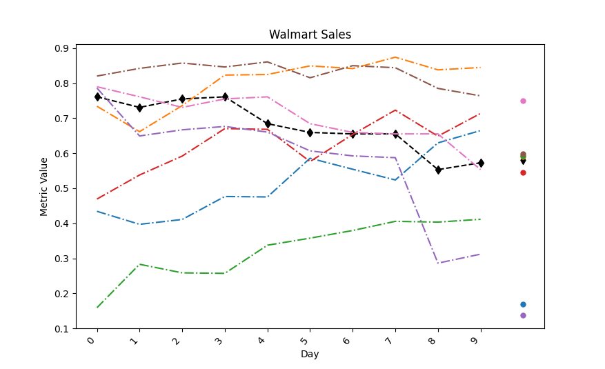
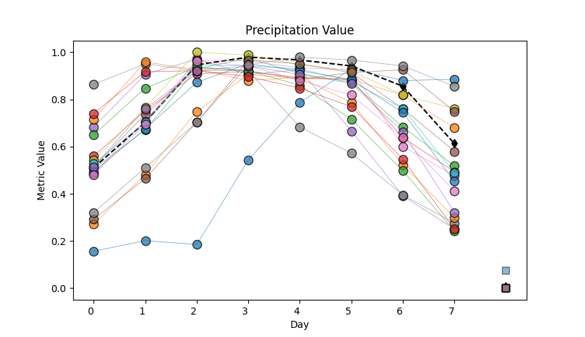
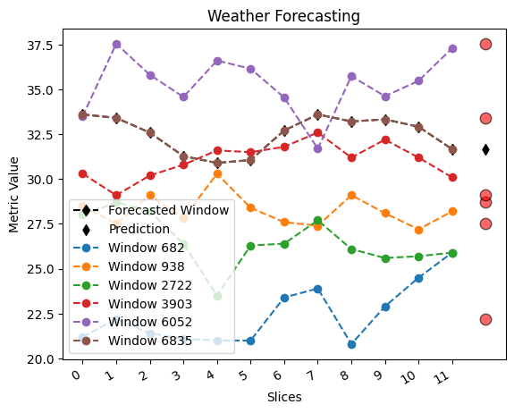

Examples
========

These examples illustrate how to use the CBR-FoX library across different datasets and scenarios, showing the full workflow from loading data to visualization.

Bitcoin Prediction
------------------

1. Import Necessary Libraries
~~~~~~~~~~~~~~~~~~~~~~~~~~~~~~~~~~~~~~~

.. code-block:: python
   :caption: Import required modules and libraries

   from cbr_fox.builder.cbr_fox_builder import cbr_fox_builder
   from cbr_fox.core import cbr_fox
   from cbr_fox.custom_distance.cci_distance import cci_distance
   import numpy as np

2. Load the Saved Data
~~~~~~~~~~~~~~~~~~~~~~~~~~

.. code-block:: python
   :caption: Load preprocessed Bitcoin prediction data from a npz file

   data = np.load("../examples/Bitcoin_prediction/Bitcoin_Prediction.npz")

3. Retrieve Variables from the Data
~~~~~~~~~~~~~~~~~~~~~~~~~~~~~~~~~~~~~~~

.. code-block:: python
   :caption: Extract relevant variables for model training and prediction

   training_windows = data['training_windows']
   forecasted_window = data['forecasted_window']
   target_training_windows = data['target_training_windows']
   windowsLen = data['windowsLen'].item()  # Extract single value
   componentsLen = data['componentsLen'].item()
   windowLen = data['windowLen'].item()
   prediction = data['prediction']

4. Define CBR-FoX Techniques
~~~~~~~~~~~~~~~~~~~~~~~~~~~~~~~~~~~~~~~

.. code-block:: python
   :caption: Set up the CBR-FoX techniques using a custom distance metric

   techniques = [
       cbr_fox.cbr_fox(metric=cci_distance, kwargs={"punishedSumFactor": 0.5})
   ]

5. Build and Train the CBR-FoX Model
~~~~~~~~~~~~~~~~~~~~~~~~~~~~~~~~~~~~~~~

.. code-block:: python
   :caption: Initialize the model builder and train on the loaded data

   p = cbr_fox_builder(techniques)
   p.fit(training_windows = training_windows,
         target_training_windows = target_training_windows,
         forecasted_window = forecasted_window)

.. code-block:: text
   :caption: Sample output from the model training process

   2025-08-27 12:56:19,487 - INFO - Analizando conjunto de datos
   ...
   2025-08-27 12:56:21,055 - INFO - Análisis finalizado

6. Make Predictions
~~~~~~~~~~~~~~~~~~~~~~~~~~

.. code-block:: python
   :caption: Generate predictions and obtain explanations for the forecasted data

   p.predict(prediction = prediction, num_cases=3)

.. code-block:: text
   :caption: Sample terminal output showing prediction report

   2025-08-27 12:56:23,598 - INFO - Generando reporte de análisis

7. Visualize Results
~~~~~~~~~~~~~~~~~~~~~~~~~~

.. code-block:: python
   :caption: Visualize predictions using a line plot with scatter markers

   p.visualize_pyplot(
       fmt = '--d',
       scatter_params={"s": 50},
       xtick_rotation=50,
       title="Bitcoin Prediction",
       xlabel="Time",
       ylabel="Value"
   )

.. image:: _static/bitcoin_image_1.png
   :align: center
   :alt: Bitcoin prediction output figure

Walmart Sales Prediction
------------------------

1. Load the Saved Data
~~~~~~~~~~~~~~~~~~~~~~~~~~

.. code-block:: python
   :caption: Load Walmart sales data from a npz file

   data = np.load("Walmart_Sales.npz")

2. Retrieve Variables from the Data
~~~~~~~~~~~~~~~~~~~~~~~~~~~~~~~~~~~~~~~

.. code-block:: python
   :caption: Extract variables required for training and forecasting

   training_windows = data['training_windows']
   forecasted_window = data['forecasted_window']
   target_training_windows = data['target_training_windows']
   windowsLen = data['windowsLen'].item()
   componentsLen = data['componentsLen'].item()
   windowLen = data['windowLen'].item()
   prediction = data['prediction']

3. Define CBR-FoX Techniques
~~~~~~~~~~~~~~~~~~~~~~~~~~~~~~~~~~~~~~~

.. code-block:: python
   :caption: Set up CBR-FoX technique with CCI distance metric

   techniques = [
       cbr_fox.cbr_fox(metric=cci_distance, kwargs={"punishedSumFactor": 0.5})
   ]

4. Build and Train the CBR-FoX Model
~~~~~~~~~~~~~~~~~~~~~~~~~~~~~~~~~~~~~~~

.. code-block:: python
   :caption: Initialize the model builder and train on Walmart data

   p = cbr_fox_builder(techniques)
   p.fit(training_windows = training_windows,
         target_training_windows = target_training_windows,
         forecasted_window = forecasted_window)

5. Make Predictions
~~~~~~~~~~~~~~~~~~~~~~~~~~

.. code-block:: python
   :caption: Generate predictions for Walmart sales

   p.predict(prediction = prediction, num_cases=3)

6. Visualize Results
~~~~~~~~~~~~~~~~~~~~~~~~~~

.. code-block:: python
   :caption: Plot Walmart Sales predictions with customized markers

   p.visualize_pyplot(
       fmt = '-.',
       legend = False,
       scatter_params={"s": 25},
       xtick_rotation=50,
       title="Walmart Sales",
       xlabel="Day",
       ylabel="Metric Value"
   )

Romania Power Usage Prediction
-------------------------------

1. Load the Saved Data
~~~~~~~~~~~~~~~~~~~~~~~~~~

.. code-block:: python
   :caption: Load Romania Power Usage dataset from 2016-2020

   data = np.load("Romania_Power_Usage_Analysis_2016_2020_CBR-FoX.npz")

2. Retrieve Variables from the Data
~~~~~~~~~~~~~~~~~~~~~~~~~~~~~~~~~~~~~~~

.. code-block:: python
   :caption: Extract training and prediction variables

   training_windows = data['training_windows']
   forecasted_window = data['forecasted_window']
   target_training_windows = data['target_training_windows']
   windowsLen = data['windowsLen'].item()
   componentsLen = data['componentsLen'].item()
   windowLen = data['windowLen'].item()
   prediction = data['prediction']

3. Define CBR-FoX Techniques
~~~~~~~~~~~~~~~~~~~~~~~~~~~~~~~~~~~~~~~

.. code-block:: python
   :caption: Define multiple techniques with different punishedSumFactor values

   techniques = [
       cbr_fox.cbr_fox(metric=cci_distance, kwargs={"punishedSumFactor":0.5}),
       cbr_fox.cbr_fox(metric=cci_distance, kwargs={"punishedSumFactor":0.7})
   ]

4. Build and Train the CBR-FoX Model
~~~~~~~~~~~~~~~~~~~~~~~~~~~~~~~~~~~~~~~

.. code-block:: python
   :caption: Train the model with multiple techniques on Romania dataset

   p = cbr_fox_builder(techniques)
   p.fit(training_windows = training_windows,
         target_training_windows = target_training_windows.reshape(-1,1),
         forecasted_window = forecasted_window)

5. Make Predictions
~~~~~~~~~~~~~~~~~~~~~~~~~~

.. code-block:: python
   :caption: Generate predictions with 5 forecast cases

   p.predict(prediction = prediction, num_cases=5)

6. Visualize Results
~~~~~~~~~~~~~~~~~~~~~~~~~~

.. code-block:: python
   :caption: Visualize predictions with line plot and scatter markers

   p.visualize_pyplot(
       fmt = '--d',
       scatter_params={"s": 50},
       xtick_rotation=50,
       title="Romania Power Usage",
       xlabel="Time",
       ylabel="Value"
   )

.. image:: _static/romania_power_usage_image.png
   :align: center
   :alt: Romania Power Usage output figure

Rainfall Prediction
--------------------

1. Load the Saved Data
~~~~~~~~~~~~~~~~~~~~~~~~~~

.. code-block:: python
   :caption: Load Rainfall prediction dataset from npz file

   data = np.load("Rainfall_Prediction.npz")

2. Retrieve Variables from the Data
~~~~~~~~~~~~~~~~~~~~~~~~~~~~~~~~~~~~~~~

.. code-block:: python
   :caption: Extract variables for model training and forecasting

   training_windows = data['training_windows']
   forecasted_window = data['forecasted_window']
   target_training_windows = data['target_training_windows']
   windowsLen = data['windowsLen'].item()
   componentsLen = data['componentsLen'].item()
   windowLen = data['windowLen'].item()
   prediction = data['prediction']

3. Define CBR-FoX Techniques
~~~~~~~~~~~~~~~~~~~~~~~~~~~~~~~~~~~~~~~

.. code-block:: python
   :caption: Set up CBR-FoX technique using CCI distance metric

   techniques = [
       cbr_fox.cbr_fox(metric=cci_distance, kwargs={"punishedSumFactor": 0.5})
   ]

4. Build and Train the CBR-FoX Model
~~~~~~~~~~~~~~~~~~~~~~~~~~~~~~~~~~~~~~~

.. code-block:: python
   :caption: Initialize the builder and train the model on rainfall data

   p = cbr_fox_builder(techniques)
   p.fit(training_windows = training_windows,
         target_training_windows = target_training_windows,
         forecasted_window = forecasted_window)

5. Make Predictions
~~~~~~~~~~~~~~~~~~~~~~~~~~

.. code-block:: python
   :caption: Generate rainfall predictions with 3 forecast cases

   p.predict(prediction = prediction, num_cases=3)

6. Visualize Results
~~~~~~~~~~~~~~~~~~~~~~~~~~

.. code-block:: python
   :caption: Plot rainfall predictions with line and scatter markers

   p.visualize_pyplot(
       fmt = '--d',
       legend = False,
       scatter_params={"s": 50},
       xtick_rotation=50,
       title="Precipitation Value",
       xlabel="Day",
       ylabel="Metric Value"
   )

Weather Forecasting
--------------------

1. Import Necessary Libraries
~~~~~~~~~~~~~~~~~~~~~~~~~~~~~

.. code-block:: python
   :caption: Import modules and dependencies for weather forecasting

   from cbr_fox.core import cbr_fox
   from cbr_fox.builder import cbr_fox_builder
   from cbr_fox.custom_distance import cci_distance
   import numpy as np
   import os

2. Load the Saved Data
~~~~~~~~~~~~~~~~~~~~~~~~~~~

.. code-block:: python
   :caption: Load preprocessed weather forecasting dataset

   data = np.load(os.path.join(os.path.dirname(__file__), "weather_forecasting.npz"))

3. Retrieve Variables from the Data
~~~~~~~~~~~~~~~~~~~~~~~~~~~~~~~~~~~~

.. code-block:: python
   :caption: Extract input features and target variables

   training_windows = data['training_windows']
   forecasted_window = data['forecasted_window']
   target_training_windows = data['target_training_windows']
   windowsLen = data['windowsLen'].item()
   componentsLen = data['componentsLen'].item()
   windowLen = data['windowLen'].item()
   prediction = data['prediction']

4. Define CBR-FoX Techniques
~~~~~~~~~~~~~~~~~~~~~~~~~~~~~~

.. code-block:: python
   :caption: Define CBR-FoX technique with CCI distance

   techniques = [
       cbr_fox.cbr_fox(metric=cci_distance, kwargs={"punishedSumFactor": 0.5})
       # cbr_fox.cbr_fox(metric="edr"),
       # cbr_fox.cbr_fox(metric="dtw"),
       # cbr_fox.cbr_fox(metric="twe")
   ]

5. Build and Train the CBR-FoX Model
~~~~~~~~~~~~~~~~~~~~~~~~~~~~~~~~~~~~~

.. code-block:: python
   :caption: Train model using weather forecasting dataset

   p = cbr_fox_builder(techniques)
   p.fit(training_windows = training_windows,
         target_training_windows = target_training_windows,
         forecasted_window = forecasted_window)

6. Make Predictions
~~~~~~~~~~~~~~~~~~~~

.. code-block:: python
   :caption: Generate predictions for weather data

   p.predict(prediction = prediction, num_cases=3)

7. Visualize Results
~~~~~~~~~~~~~~~~~~~~~

.. code-block:: python
   :caption: Visualize weather forecast results with custom scatter plot

   p.visualize_pyplot(
       fmt = '--o',
       legend = True,
       scatter_params = {"s": 80, "c": "red", "alpha": 0.6, "edgecolors": "black"},
       xtick_rotation = 30,
       title="Weather Forecasting",
       xlabel="Slices",
       ylabel="Metric Value"
   )

