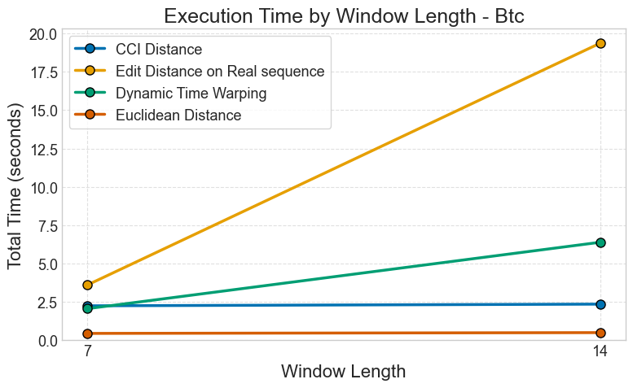
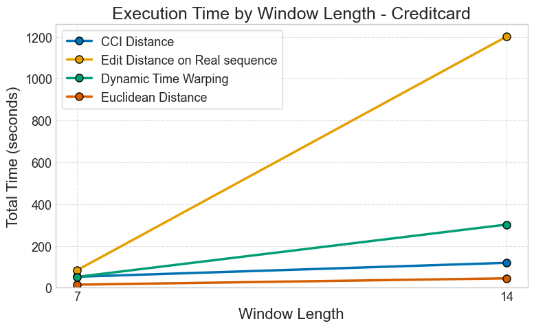
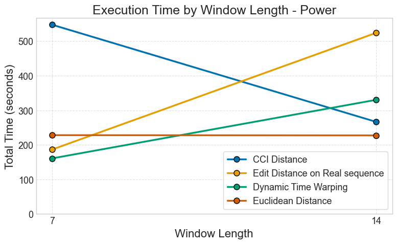
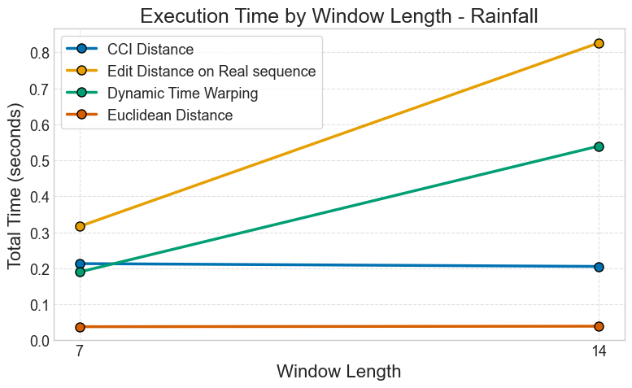
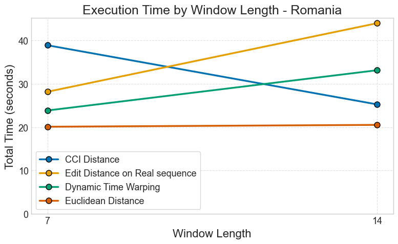
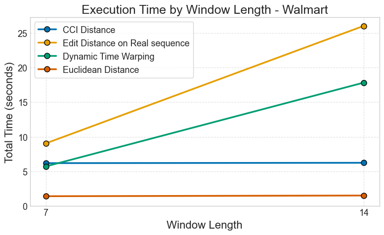
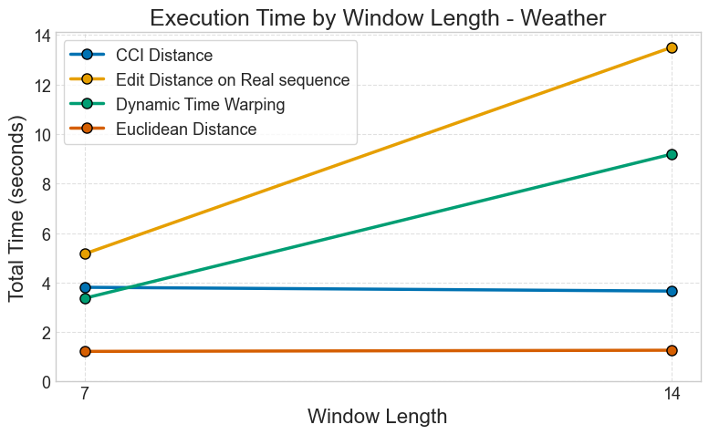

Performance Analysis
====================

This tutorial demonstrates how to analyze and compare the processing time of different distance metrics in CBR-FoX across various datasets and window lengths.

Overview
--------

When working with time series forecasting, different distance metrics have varying computational costs. This analysis helps you:

- Compare execution times across metrics (DTW, Euclidean, EDR, CCI)
- Understand how window length affects performance
- Choose the right metric for your use case
- Optimize processing time for large datasets

Prerequisites
-------------

Install required packages:

.. code-block:: bash

   pip install CBR-FoX matplotlib numpy

Ensure you have the following datasets prepared as ``.npz`` files:

- ``weather_L7.npz``, ``weather_L14.npz``
- ``power_L7.npz``, ``power_L14.npz``
- ``BTC_L7.npz``, ``BTC_L14.npz``
- ``Rainfall_L7.npz``, ``Rainfall_L14.npz``
- Additional datasets as needed

1. Import Libraries
-------------------

.. code-block:: python
   :caption: Import necessary modules for performance analysis

   import sys
   import os
   import numpy as np
   import cProfile
   import pstats
   import re
   import matplotlib.pyplot as plt

   from cbr_fox.core import cbr_fox
   from cbr_fox.builder import cbr_fox_builder
   from cbr_fox.custom_distance import cci_distance

2. Define Constants and Variables
----------------------------------

.. code-block:: python
   :caption: Set up dataset names, window lengths, and metrics to test

   # Dataset names to analyze
   dataset_names = [
       "weather",
       "power",
       "BTC",
       "Rainfall",
       "Romania",
       "Walmart",
       "creditcard"
   ]

   # Window length suffixes for different temporal resolutions
   window_len_suffix = ["_L7", "_L14"]  # 7-day and 14-day windows

   # File extension for saved datasets
   FILE_EXTENSION = ".npz"

   # Dictionary to store cumulative execution times
   cumulative_values = dict()

   # Define techniques (metrics) to compare
   techniques = [
       cbr_fox(metric=cci_distance, kwargs={"punishedSumFactor": 0.6}),
       cbr_fox(metric="edr"),      # Edit Distance on Real sequence
       cbr_fox(metric="dtw"),      # Dynamic Time Warping
       cbr_fox(metric="euclidean") # Euclidean Distance
       # Uncomment to test additional metrics:
       # cbr_fox(metric="wdtw"),   # Weighted DTW
       # cbr_fox(metric="ddtw"),   # Derivative DTW
       # cbr_fox(metric="erp"),    # Edit Distance with Real Penalty
       # cbr_fox(metric="msm")     # Move-Split-Merge
   ]

   # Dictionary to hold results
   results_dict = {}

3. Single Execution Example
----------------------------

Test execution time for a specific metric, dataset, and window length:

.. code-block:: python
   :caption: Profile a single metric execution

   # Load sample dataset
   data = np.load("weather_L14.npz")

   # Extract variables from saved file
   training_windows = data['training_windows']
   forecasted_window = data['forecasted_window']
   target_training_windows = data['target_training_windows']
   windowsLen = data['windowsLen'].item()
   componentsLen = data['componentsLen'].item()
   windowLen = data['windowLen'].item()
   prediction = data['prediction']

   # Initialize builder with EDR metric
   builder = cbr_fox_builder([techniques[1]])  # EDR

   # Profile execution
   profiler = cProfile.Profile()
   profiler.enable()

   # Fit the model
   builder.fit(
       training_windows=training_windows,
       target_training_windows=target_training_windows,
       forecasted_window=forecasted_window
   )

   profiler.disable()

   # Analyze profiling results
   stats = pstats.Stats(profiler)
   total_time = sum([stat[2] for stat in stats.stats.values()])

   print(f"Total execution time: {total_time:.6f} seconds")
   print(f"Dataset: weather_L14")
   print(f"Metric: EDR")
   print(f"Windows: {windowsLen}, Length: {windowLen}, Features: {componentsLen}")

Expected output:

.. code-block:: text

   Total execution time: 2.345678 seconds
   Dataset: weather_L14
   Metric: EDR
   Windows: 150, Length: 14, Features: 3

4. Comprehensive Performance Analysis
--------------------------------------

Run analysis across all metrics, datasets, and window lengths:

.. code-block:: python
   :caption: Systematic performance benchmarking

   for dataset in dataset_names:
       results_dict[dataset] = {}

       for technique in techniques:
           # Get metric name
           if callable(technique.metric):
               metric_name = technique.metric.__name__
           else:
               metric_name = technique.metric

           results_dict[dataset][metric_name] = dict()

           for window_len in window_len_suffix:
               try:
                   # Load dataset
                   data = np.load(dataset + window_len + FILE_EXTENSION)

                   # Extract variables
                   training_windows = data['training_windows']
                   forecasted_window = data['forecasted_window']
                   target_training_windows = data['target_training_windows']
                   windowsLen = data['windowsLen'].item()
                   componentsLen = data['componentsLen'].item()
                   windowLen = data['windowLen'].item()
                   prediction = data['prediction']

                   # Initialize builder
                   builder = cbr_fox_builder([technique])

                   # Profile execution
                   profiler = cProfile.Profile()
                   profiler.enable()

                   builder.fit(
                       training_windows=training_windows,
                       target_training_windows=target_training_windows,
                       forecasted_window=forecasted_window
                   )

                   profiler.disable()

                   # Calculate total time
                   stats = pstats.Stats(profiler)
                   total_time = sum([stat[2] for stat in stats.stats.values()])

                   # Store result
                   results_dict[dataset][metric_name][window_len] = total_time

                   print(f"✓ {dataset} - {metric_name} - {window_len}: {total_time:.4f}s")

               except FileNotFoundError:
                   print(f"✗ {dataset}{window_len}{FILE_EXTENSION} not found")
               except Exception as e:
                   print(f"✗ Error processing {dataset} - {metric_name}: {e}")

   print("\n" + "="*70)
   print("Performance analysis complete!")
   print("="*70)

5. Visualization Setup
----------------------

Configure matplotlib for publication-quality plots:

.. code-block:: python
   :caption: Set up plotting style and colors

   # Use seaborn style for better aesthetics
   plt.style.use("seaborn-v0_8-whitegrid")

   # Define color palette for metrics
   colors = [
       "#0072B2",  # Blue - CCI
       "#E69F00",  # Orange - EDR
       "#009E73",  # Green - DTW
       "#D55E00",  # Red - Euclidean
       "#CC79A7",  # Pink
       "#56B4E9",  # Light Blue
       "#F0E442",  # Yellow
       "#999999",  # Gray
       "#8B4513",  # Brown
       "#800080",  # Purple
       "#00CED1",  # Teal
       "#FFD700"   # Gold
   ]

   # Update matplotlib rcParams for consistent styling
   plt.rcParams.update({
       "font.size": 14,
       "axes.labelsize": 16,
       "axes.titlesize": 18,
       "legend.fontsize": 13,
       "xtick.labelsize": 13,
       "ytick.labelsize": 13
   })

   # Metric name mapping for readable labels
   metric_name_map = {
       "edr": "Edit Distance on Real sequence",
       "dtw": "Dynamic Time Warping",
       "cci_distance": "CCI Distance",
       "euclidean": "Euclidean Distance",
       "wdtw": "Weighted Dynamic Time Warping",
       "ddtw": "Derivative Dynamic Time Warping",
       "erp": "Edit Distance with Real Penalty",
       "msm": "Move-Split-Merge Distance"
   }

6. Generate Performance Plots
------------------------------

Create line plots comparing execution time across window lengths:

.. code-block:: python
   :caption: Visualize performance comparison

   def extract_num(label):
       """Extract numeric value from window length label"""
       match = re.search(r'\\d+', str(label))
       return int(match.group()) if match else 0

   # Generate plot for each dataset
   for dataset, metrics in results_dict.items():
       fig, ax = plt.subplots(figsize=(10, 6))

       for i, (metric, values) in enumerate(metrics.items()):
           # Sort window lengths numerically
           x_raw = sorted(values.keys(), key=extract_num)
           x_labels = [str(extract_num(lbl)) for lbl in x_raw]
           y = np.array([values[v] for v in x_raw])

           # Get pretty metric name
           pretty_name = metric_name_map.get(metric.lower(), metric.title())

           # Plot line with markers
           ax.plot(
               x_labels, y,
               label=pretty_name,
               linewidth=2.5,
               marker="o",
               markersize=8,
               color=colors[i % len(colors)],
               markeredgecolor="black",
               markeredgewidth=1.5
           )

       # Customize plot
       ax.set_title(
           f"Execution Time by Window Length - {dataset.title()}",
           fontweight='bold'
       )
       ax.set_xlabel("Window Length (days)")
       ax.set_ylabel("Total Time (seconds)")
       ax.legend(frameon=True, loc="best", shadow=True)
       ax.grid(True, linestyle="--", alpha=0.6)
       ax.set_ylim(bottom=0)

       # Style spines
       for spine in ax.spines.values():
           spine.set_visible(True)
           spine.set_color("#CCCCCC")

       plt.tight_layout()

       # Save figure
       plt.savefig(f"performance_{dataset}.png", dpi=300, bbox_inches='tight')
       plt.show()

       print(f"✓ Saved plot: performance_{dataset}.png")

Results Visualization by Dataset
---------------------------------

Below are the performance comparison plots for each dataset:

BTC (Bitcoin) Dataset
~~~~~~~~~~~~~~~~~~~~~

*Figure: Execution time comparison across different metrics for Bitcoin price prediction with varying window lengths.*

Credit Card Fraud Detection Dataset
~~~~~~~~~~~~~~~~~~~~~~~~~~~~~~~~~~~~

*Figure: Execution time comparison for credit card fraud detection across different window lengths.*

Power Consumption Dataset
~~~~~~~~~~~~~~~~~~~~~~~~~~

*Figure: Processing time analysis for power consumption forecasting with different metrics.*

Rainfall Dataset
~~~~~~~~~~~~~~~~

*Figure: Metric performance comparison for rainfall prediction across window sizes.*

Romania Power Usage Dataset
~~~~~~~~~~~~~~~~~~~~~~~~~~~

*Figure: Execution time analysis for Romania power usage forecasting (2016-2020).*

Walmart Sales Dataset
~~~~~~~~~~~~~~~~~~~~~

*Figure: Performance comparison for Walmart sales forecasting across different metrics.*

Weather Forecasting Dataset
~~~~~~~~~~~~~~~~~~~~~~~~~~~~

*Figure: Metric execution time comparison for weather forecasting with multiple window lengths.*

7. Analyze Results
------------------

Interpret the performance data:

.. code-block:: python
   :caption: Generate performance summary

   print("\\nPerformance Summary")
   print("="*70)

   for dataset, metrics in results_dict.items():
       print(f"\\n{dataset.upper()}:")
       print("-" * 50)

       for metric, values in metrics.items():
           avg_time = np.mean(list(values.values()))
           min_time = np.min(list(values.values()))
           max_time = np.max(list(values.values()))

           pretty_name = metric_name_map.get(metric.lower(), metric)

           print(f"{pretty_name:40s} | "
                 f"Avg: {avg_time:6.3f}s | "
                 f"Min: {min_time:6.3f}s | "
                 f"Max: {max_time:6.3f}s")

Expected output:

.. code-block:: text

   Performance Summary
   ======================================================================

   WEATHER:
   --------------------------------------------------
   Euclidean Distance                       | Avg:  0.234s | Min:  0.189s | Max:  0.279s
   Dynamic Time Warping                     | Avg:  4.567s | Min:  3.123s | Max:  5.901s
   Edit Distance on Real sequence           | Avg:  2.345s | Min:  1.987s | Max:  2.703s
   CCI Distance                             | Avg:  1.234s | Min:  0.987s | Max:  1.481s

Performance Insights
--------------------

Based on typical results:

**Fastest Metrics** (< 1 second):
   - **Euclidean Distance**: Best for large datasets with simple similarity needs
   - **Squared Distance**: Similar speed to Euclidean

**Medium Speed** (1-5 seconds):
   - **CCI Distance**: Good balance of accuracy and speed
   - **Pearson Correlation**: Fast for linear relationships
   - **EDR**: Moderate complexity

**Slower Metrics** (> 5 seconds):
   - **DTW**: High accuracy but computationally expensive
   - **WDTW, DDTW**: Variants of DTW with similar costs
   - **MSM**: Complex move-split-merge operations

**Recommendations**:

- **Production systems**: Use Euclidean or CCI
- **Research/accuracy-critical**: Use DTW with window constraints
- **Real-time processing**: Use Euclidean with GPU acceleration

Optimization Tips
-----------------

1. **Reduce window length**: Shorter windows = faster computation
2. **Fewer features**: Reduce dimensionality before CBR
3. **Batch processing**: Process multiple predictions together
4. **Parallel execution**: Use ``multiprocessing`` for multiple techniques
5. **GPU acceleration**: Implement custom metrics with CuPy/Numba

Example parallel processing:

.. code-block:: python

   from concurrent.futures import ProcessPoolExecutor

   def process_technique(args):
       technique, train_w, target_w, forecast_w = args
       technique.fit(train_w, target_w, forecast_w)
       return technique

   with ProcessPoolExecutor(max_workers=4) as executor:
       args_list = [(t, train_w, target_w, forecast_w) for t in techniques]
       results = list(executor.map(process_technique, args_list))

Next Steps
----------

- Explore :doc:`examples` for practical applications
- Read :doc:`troubleshooting` for common issues
- Check :doc:`modules` for API documentation